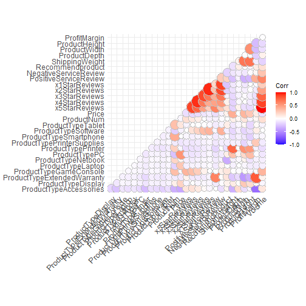
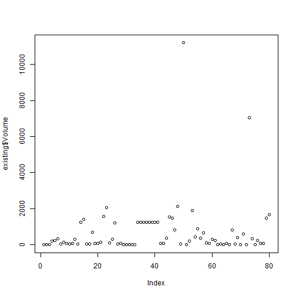
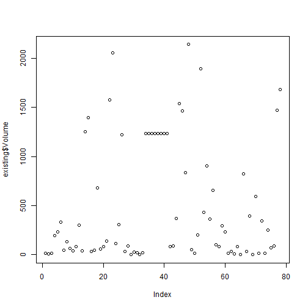

<div style="margin-bottom:100px;">
</div>

<h2 style="text-align: center;">Introduction</h2>

<p style="text-align: justify;">On this report, profitability of (a) certain article(s) will be demonstrated. The df for the task consists of 80 observations, from a df of existing products and 24 of a list of possible candidates.</p>

<div style="margin-bottom:100px;">
</div>

<h2 style="text-align: center;">Used Libraries</h2>


```r
library(ggplot2)
library(ggthemes)
library(caret)
library(mlbench)
library(dplyr)
library(reshape2)
library(knitr)
library(kableExtra)
```


<div style="margin-bottom:100px;">
</div>

<h2 style="text-align: center;">Data</h2>


```r
existing <- read.csv("Data/existing.csv")
new <- read.csv("Data/new.csv")

#taking a look at the variables
kable(head(existing), format = "latex") %>% 
  kable_styling(latex_options="scale_down")
```

\begin{table}[H]
\centering
\resizebox{\linewidth}{!}{
\begin{tabular}{l|r|r|r|r|r|r|r|r|r|r|r|r|r|r|r|r|r}
\hline
ProductType & ProductNum & Price & x5StarReviews & x4StarReviews & x3StarReviews & x2StarReviews & x1StarReviews & PositiveServiceReview & NegativeServiceReview & Recommendproduct & BestSellersRank & ShippingWeight & ProductDepth & ProductWidth & ProductHeight & ProfitMargin & Volume\\
\hline
PC & 101 & 949.00 & 3 & 3 & 2 & 0 & 0 & 2 & 0 & 0.9 & 1967 & 25.8 & 23.94 & 6.62 & 16.89 & 0.15 & 12\\
\hline
PC & 102 & 2249.99 & 2 & 1 & 0 & 0 & 0 & 1 & 0 & 0.9 & 4806 & 50.0 & 35.00 & 31.75 & 19.00 & 0.25 & 8\\
\hline
PC & 103 & 399.00 & 3 & 0 & 0 & 0 & 0 & 1 & 0 & 0.9 & 12076 & 17.4 & 10.50 & 8.30 & 10.20 & 0.08 & 12\\
\hline
Laptop & 104 & 409.99 & 49 & 19 & 8 & 3 & 9 & 7 & 8 & 0.8 & 109 & 5.7 & 15.00 & 9.90 & 1.30 & 0.08 & 196\\
\hline
Laptop & 105 & 1079.99 & 58 & 31 & 11 & 7 & 36 & 7 & 20 & 0.7 & 268 & 7.0 & 12.90 & 0.30 & 8.90 & 0.09 & 232\\
\hline
Accessories & 106 & 114.22 & 83 & 30 & 10 & 9 & 40 & 12 & 5 & 0.3 & 64 & 1.6 & 5.80 & 4.00 & 1.00 & 0.05 & 332\\
\hline
\end{tabular}}
\end{table}

```r
kable(head(new))
```

<table>
 <thead>
  <tr>
   <th style="text-align:left;"> ProductType </th>
   <th style="text-align:right;"> ProductNum </th>
   <th style="text-align:right;"> Price </th>
   <th style="text-align:right;"> x5StarReviews </th>
   <th style="text-align:right;"> x4StarReviews </th>
   <th style="text-align:right;"> x3StarReviews </th>
   <th style="text-align:right;"> x2StarReviews </th>
   <th style="text-align:right;"> x1StarReviews </th>
   <th style="text-align:right;"> PositiveServiceReview </th>
   <th style="text-align:right;"> NegativeServiceReview </th>
   <th style="text-align:right;"> Recommendproduct </th>
   <th style="text-align:right;"> BestSellersRank </th>
   <th style="text-align:right;"> ShippingWeight </th>
   <th style="text-align:right;"> ProductDepth </th>
   <th style="text-align:right;"> ProductWidth </th>
   <th style="text-align:right;"> ProductHeight </th>
   <th style="text-align:right;"> ProfitMargin </th>
   <th style="text-align:right;"> Volume </th>
  </tr>
 </thead>
<tbody>
  <tr>
   <td style="text-align:left;"> PC </td>
   <td style="text-align:right;"> 171 </td>
   <td style="text-align:right;"> 699.00 </td>
   <td style="text-align:right;"> 96 </td>
   <td style="text-align:right;"> 26 </td>
   <td style="text-align:right;"> 14 </td>
   <td style="text-align:right;"> 14 </td>
   <td style="text-align:right;"> 25 </td>
   <td style="text-align:right;"> 12 </td>
   <td style="text-align:right;"> 3 </td>
   <td style="text-align:right;"> 0.7 </td>
   <td style="text-align:right;"> 2498 </td>
   <td style="text-align:right;"> 19.9 </td>
   <td style="text-align:right;"> 20.63 </td>
   <td style="text-align:right;"> 19.25 </td>
   <td style="text-align:right;"> 8.39 </td>
   <td style="text-align:right;"> 0.25 </td>
   <td style="text-align:right;"> 0 </td>
  </tr>
  <tr>
   <td style="text-align:left;"> PC </td>
   <td style="text-align:right;"> 172 </td>
   <td style="text-align:right;"> 860.00 </td>
   <td style="text-align:right;"> 51 </td>
   <td style="text-align:right;"> 11 </td>
   <td style="text-align:right;"> 10 </td>
   <td style="text-align:right;"> 10 </td>
   <td style="text-align:right;"> 21 </td>
   <td style="text-align:right;"> 7 </td>
   <td style="text-align:right;"> 5 </td>
   <td style="text-align:right;"> 0.6 </td>
   <td style="text-align:right;"> 490 </td>
   <td style="text-align:right;"> 27.0 </td>
   <td style="text-align:right;"> 21.89 </td>
   <td style="text-align:right;"> 27.01 </td>
   <td style="text-align:right;"> 9.13 </td>
   <td style="text-align:right;"> 0.20 </td>
   <td style="text-align:right;"> 0 </td>
  </tr>
  <tr>
   <td style="text-align:left;"> Laptop </td>
   <td style="text-align:right;"> 173 </td>
   <td style="text-align:right;"> 1199.00 </td>
   <td style="text-align:right;"> 74 </td>
   <td style="text-align:right;"> 10 </td>
   <td style="text-align:right;"> 3 </td>
   <td style="text-align:right;"> 3 </td>
   <td style="text-align:right;"> 11 </td>
   <td style="text-align:right;"> 11 </td>
   <td style="text-align:right;"> 5 </td>
   <td style="text-align:right;"> 0.8 </td>
   <td style="text-align:right;"> 111 </td>
   <td style="text-align:right;"> 6.6 </td>
   <td style="text-align:right;"> 8.94 </td>
   <td style="text-align:right;"> 12.80 </td>
   <td style="text-align:right;"> 0.68 </td>
   <td style="text-align:right;"> 0.10 </td>
   <td style="text-align:right;"> 0 </td>
  </tr>
  <tr>
   <td style="text-align:left;"> Laptop </td>
   <td style="text-align:right;"> 175 </td>
   <td style="text-align:right;"> 1199.00 </td>
   <td style="text-align:right;"> 7 </td>
   <td style="text-align:right;"> 2 </td>
   <td style="text-align:right;"> 1 </td>
   <td style="text-align:right;"> 1 </td>
   <td style="text-align:right;"> 1 </td>
   <td style="text-align:right;"> 2 </td>
   <td style="text-align:right;"> 1 </td>
   <td style="text-align:right;"> 0.6 </td>
   <td style="text-align:right;"> 4446 </td>
   <td style="text-align:right;"> 13.0 </td>
   <td style="text-align:right;"> 16.30 </td>
   <td style="text-align:right;"> 10.80 </td>
   <td style="text-align:right;"> 1.40 </td>
   <td style="text-align:right;"> 0.15 </td>
   <td style="text-align:right;"> 0 </td>
  </tr>
  <tr>
   <td style="text-align:left;"> Laptop </td>
   <td style="text-align:right;"> 176 </td>
   <td style="text-align:right;"> 1999.00 </td>
   <td style="text-align:right;"> 1 </td>
   <td style="text-align:right;"> 1 </td>
   <td style="text-align:right;"> 1 </td>
   <td style="text-align:right;"> 3 </td>
   <td style="text-align:right;"> 0 </td>
   <td style="text-align:right;"> 0 </td>
   <td style="text-align:right;"> 1 </td>
   <td style="text-align:right;"> 0.3 </td>
   <td style="text-align:right;"> 2820 </td>
   <td style="text-align:right;"> 11.6 </td>
   <td style="text-align:right;"> 16.81 </td>
   <td style="text-align:right;"> 10.90 </td>
   <td style="text-align:right;"> 0.88 </td>
   <td style="text-align:right;"> 0.23 </td>
   <td style="text-align:right;"> 0 </td>
  </tr>
  <tr>
   <td style="text-align:left;"> Netbook </td>
   <td style="text-align:right;"> 178 </td>
   <td style="text-align:right;"> 399.99 </td>
   <td style="text-align:right;"> 19 </td>
   <td style="text-align:right;"> 8 </td>
   <td style="text-align:right;"> 4 </td>
   <td style="text-align:right;"> 1 </td>
   <td style="text-align:right;"> 10 </td>
   <td style="text-align:right;"> 2 </td>
   <td style="text-align:right;"> 4 </td>
   <td style="text-align:right;"> 0.6 </td>
   <td style="text-align:right;"> 4140 </td>
   <td style="text-align:right;"> 5.8 </td>
   <td style="text-align:right;"> 8.43 </td>
   <td style="text-align:right;"> 11.42 </td>
   <td style="text-align:right;"> 1.20 </td>
   <td style="text-align:right;"> 0.08 </td>
   <td style="text-align:right;"> 0 </td>
  </tr>
</tbody>
</table>


<div style="margin-bottom:100px;">
</div>

<h2 style="text-align: center;">First Analysis</h2>


```r
#creating dummy vars to explore correlation
tempdf <- dummyVars(" ~ .", data = existing)
existingCor <- data.frame(predict(tempdf, newdata = existing))

#check for missing data
summary(existingCor)
```

 ProductTypeAccessories ProductTypeDisplay
 Min.   :0.000          Min.   :0.0000    
 1st Qu.:0.000          1st Qu.:0.0000    
 Median :0.000          Median :0.0000    
 Mean   :0.325          Mean   :0.0625    
 3rd Qu.:1.000          3rd Qu.:0.0000    
 Max.   :1.000          Max.   :1.0000    
                                          
 ProductTypeExtendedWarranty ProductTypeGameConsole
 Min.   :0.000               Min.   :0.000         
 1st Qu.:0.000               1st Qu.:0.000         
 Median :0.000               Median :0.000         
 Mean   :0.125               Mean   :0.025         
 3rd Qu.:0.000               3rd Qu.:0.000         
 Max.   :1.000               Max.   :1.000         
                                                   
 ProductTypeLaptop ProductTypeNetbook ProductTypePC 
 Min.   :0.0000    Min.   :0.000      Min.   :0.00  
 1st Qu.:0.0000    1st Qu.:0.000      1st Qu.:0.00  
 Median :0.0000    Median :0.000      Median :0.00  
 Mean   :0.0375    Mean   :0.025      Mean   :0.05  
 3rd Qu.:0.0000    3rd Qu.:0.000      3rd Qu.:0.00  
 Max.   :1.0000    Max.   :1.000      Max.   :1.00  
                                                    
 ProductTypePrinter ProductTypePrinterSupplies
 Min.   :0.00       Min.   :0.0000            
 1st Qu.:0.00       1st Qu.:0.0000            
 Median :0.00       Median :0.0000            
 Mean   :0.15       Mean   :0.0375            
 3rd Qu.:0.00       3rd Qu.:0.0000            
 Max.   :1.00       Max.   :1.0000            
                                              
 ProductTypeSmartphone ProductTypeSoftware
 Min.   :0.00          Min.   :0.000      
 1st Qu.:0.00          1st Qu.:0.000      
 Median :0.00          Median :0.000      
 Mean   :0.05          Mean   :0.075      
 3rd Qu.:0.00          3rd Qu.:0.000      
 Max.   :1.00          Max.   :1.000      
                                          
 ProductTypeTablet   ProductNum        Price        
 Min.   :0.0000    Min.   :101.0   Min.   :   3.60  
 1st Qu.:0.0000    1st Qu.:120.8   1st Qu.:  52.66  
 Median :0.0000    Median :140.5   Median : 132.72  
 Mean   :0.0375    Mean   :142.6   Mean   : 247.25  
 3rd Qu.:0.0000    3rd Qu.:160.2   3rd Qu.: 352.49  
 Max.   :1.0000    Max.   :200.0   Max.   :2249.99  
                                                    
 x5StarReviews    x4StarReviews    x3StarReviews   
 Min.   :   0.0   Min.   :  0.00   Min.   :  0.00  
 1st Qu.:  10.0   1st Qu.:  2.75   1st Qu.:  2.00  
 Median :  50.0   Median : 22.00   Median :  7.00  
 Mean   : 176.2   Mean   : 40.20   Mean   : 14.79  
 3rd Qu.: 306.5   3rd Qu.: 33.00   3rd Qu.: 11.25  
 Max.   :2801.0   Max.   :431.00   Max.   :162.00  
                                                   
 x2StarReviews    x1StarReviews     PositiveServiceReview
 Min.   :  0.00   Min.   :   0.00   Min.   :  0.00       
 1st Qu.:  1.00   1st Qu.:   2.00   1st Qu.:  2.00       
 Median :  3.00   Median :   8.50   Median :  5.50       
 Mean   : 13.79   Mean   :  37.67   Mean   : 51.75       
 3rd Qu.:  7.00   3rd Qu.:  15.25   3rd Qu.: 42.00       
 Max.   :370.00   Max.   :1654.00   Max.   :536.00       
                                                         
 NegativeServiceReview Recommendproduct BestSellersRank
 Min.   :  0.000       Min.   :0.100    Min.   :    1  
 1st Qu.:  1.000       1st Qu.:0.700    1st Qu.:    7  
 Median :  3.000       Median :0.800    Median :   27  
 Mean   :  6.225       Mean   :0.745    Mean   : 1126  
 3rd Qu.:  6.250       3rd Qu.:0.900    3rd Qu.:  281  
 Max.   :112.000       Max.   :1.000    Max.   :17502  
                                        NA's   :15     
 ShippingWeight     ProductDepth      ProductWidth   
 Min.   : 0.0100   Min.   :  0.000   Min.   : 0.000  
 1st Qu.: 0.5125   1st Qu.:  4.775   1st Qu.: 1.750  
 Median : 2.1000   Median :  7.950   Median : 6.800  
 Mean   : 9.6681   Mean   : 14.425   Mean   : 7.819  
 3rd Qu.:11.2050   3rd Qu.: 15.025   3rd Qu.:11.275  
 Max.   :63.0000   Max.   :300.000   Max.   :31.750  
                                                     
 ProductHeight     ProfitMargin        Volume     
 Min.   : 0.000   Min.   :0.0500   Min.   :    0  
 1st Qu.: 0.400   1st Qu.:0.0500   1st Qu.:   40  
 Median : 3.950   Median :0.1200   Median :  200  
 Mean   : 6.259   Mean   :0.1545   Mean   :  705  
 3rd Qu.:10.300   3rd Qu.:0.2000   3rd Qu.: 1226  
 Max.   :25.800   Max.   :0.4000   Max.   :11204  
                                                  

```r
#since BestSellersRank has, it´ll be excluded, instead of exclusing 15 rows in the, already small, df
existingCor$BestSellersRank <- NULL

#correlation matrix to understand the relationship between the features
cor <- round(cor(existingCor), 4)

#visualiing the correlation structures
ggcorrplot::ggcorrplot(cor, method = "circle", type = "lower") #5*reviews and Volume are perfectly cor. gotta watch out
```



```r
#Check outliers
plot(existing$Volume)
```



```r
#Cleaning outliers
existing <- filter(existing, existing$Volume < 7000)
plot(existing$Volume)
```




<div style="margin-bottom:100px;">
</div>

<h2 style="text-align: center;">Feature Selection</h2>


```r
#select features to be used on the models based on correlation
set.seed(99)

#df subseting
sub_existing <- existing %>% select(c("Volume",
                                      "x4StarReviews",
                                      "x3StarReviews",
                                      "x2StarReviews",
                                      "PositiveServiceReview",
                                      "NegativeServiceReview"))

sub_new <- new %>% select(c("Volume",
                            "x4StarReviews",
                            "x3StarReviews",
                            "x2StarReviews",
                            "PositiveServiceReview",
                            "NegativeServiceReview"))

#Normalise/scale attributes except the dependent feature
sub_existing[,c(2:6)] <- lapply(sub_existing[,c(2:6)] , scale)

sub_new[,c(2:6)] <- lapply(sub_new[,c(2:6)] , scale)

str(sub_existing)
```

'data.frame':	78 obs. of  6 variables:
 $ Volume               : int  12 8 12 196 232 332 44 132 64 40 ...
 $ x4StarReviews        : num [1:78, 1] -0.612 -0.6543 -0.6755 -0.2733 -0.0193 ...
  ..- attr(*, "scaled:center")= num 31.9
  ..- attr(*, "scaled:scale")= num 47.2
 $ x3StarReviews        : num [1:78, 1] -0.399 -0.481 -0.481 -0.154 -0.031 ...
  ..- attr(*, "scaled:center")= num 11.8
  ..- attr(*, "scaled:scale")= num 24.4
 $ x2StarReviews        : num [1:78, 1] -0.264 -0.264 -0.264 -0.195 -0.103 ...
  ..- attr(*, "scaled:center")= num 11.4
  ..- attr(*, "scaled:scale")= num 43.4
 $ PositiveServiceReview: num [1:78, 1] -0.483 -0.494 -0.494 -0.427 -0.427 ...
  ..- attr(*, "scaled:center")= num 45.5
  ..- attr(*, "scaled:scale")= num 90.1
 $ NegativeServiceReview: num [1:78, 1] -0.414 -0.414 -0.414 0.144 0.98 ...
  ..- attr(*, "scaled:center")= num 5.94
  ..- attr(*, "scaled:scale")= num 14.4

```r
#Splitting data into training set and testing set for cross validation
indexing <- createDataPartition(sub_existing$Volume, p = .75, list = FALSE)
training <- sub_existing[indexing,]
testing <- sub_existing[-indexing,]
```


<div style="margin-bottom:100px;">
</div>

<h2 style="text-align: center;">Models</h2>


```r
#######################   RANDOM FOREST   ###########################


RFcontrol <- trainControl(method = "repeatedcv",               
                          number = 10, 
                          repeats = 4, 
                          search="random")

#rfGrid <- expand.grid(mtry=c(9,10,11,12,13))

set.seed(33)

#random forest model
RFmodel <- train(Volume~., 
                 data = training, 
                 method = "rf",
                 trControl=RFcontrol, 
                 #tuneGrid=rfGrid, 
                 #classProbs = TRUE,
                 tuneLength=11, 
                 importance=T)
```

1 package is needed for this model and is not installed. (randomForest). Would you like to try to install it now?
1: yes
2: no

Enter an item from the menu, or 0 to exit

```
## Installing package into 'C:/Users/Lenovo/OneDrive/Documentos/R/win-library/4.0'
## (as 'lib' is unspecified)
```

package 'randomForest' successfully unpacked and MD5 sums checked

The downloaded binary packages are in
	C:\Users\Lenovo\AppData\Local\Temp\Rtmp0Uckud\downloaded_packages

```r
#view model
RFmodel
```

Random Forest 

60 samples
 5 predictor

No pre-processing
Resampling: Cross-Validated (10 fold, repeated 4 times) 
Summary of sample sizes: 54, 52, 55, 55, 55, 55, ... 
Resampling results across tuning parameters:

  mtry  RMSE      Rsquared   MAE     
  1     255.3631  0.8606829  154.6713
  2     222.2908  0.9047109  131.6855
  4     191.6605  0.9262762  109.3563
  5     187.7301  0.9259371  107.1676

RMSE was used to select the optimal model using
 the smallest value.
The final value used for the model was mtry = 5.

```r
#variable importance
VarImpRF <- varImp(RFmodel)
VarImpRF
```

rf variable importance

                       Overall
PositiveServiceReview 100.0000
x4StarReviews          31.3868
x3StarReviews           7.1951
NegativeServiceReview   0.8655
x2StarReviews           0.0000

```r
#prediction
predRF <- predict(RFmodel, newdata = testing)

#summary(pred)
postResample(predRF, testing$Volume)
```

      RMSE   Rsquared        MAE 
186.064003   0.913785  98.396401 

```r
############################   k-NN   ###############################


KNNcontrol <- trainControl(method = "repeatedcv", 
                           number = 10, 
                           repeats = 3,
                           classProbs = TRUE)

set.seed(832)

#KNN model
KNNmodel <- train(Volume ~., 
                  data = training, 
                  method = "knn",
                  knnControl=KNNcontrol,
                  tuneGrid = expand.grid(k = c(1:20)),
                  tuneLength = 10,
                  importance = T)

#view results
KNNmodel
```

k-Nearest Neighbors 

60 samples
 5 predictor

No pre-processing
Resampling: Bootstrapped (25 reps) 
Summary of sample sizes: 60, 60, 60, 60, 60, 60, ... 
Resampling results across tuning parameters:

  k   RMSE      Rsquared   MAE     
   1  321.1413  0.7064408  153.5474
   2  308.5691  0.7253383  151.4339
   3  304.4229  0.7286820  154.1655
   4  298.7306  0.7373523  153.6564
   5  301.9465  0.7350804  156.4315
   6  302.0525  0.7383541  157.2879
   7  304.9211  0.7347187  157.9686
   8  310.5975  0.7229617  160.5376
   9  313.8686  0.7191192  161.3213
  10  313.0373  0.7205441  161.3704
  11  317.7194  0.7154332  167.4154
  12  322.2875  0.7063341  168.1190
  13  324.6940  0.7068770  168.2876
  14  335.1926  0.6951860  174.3773
  15  343.3045  0.6854704  182.3545
  16  349.7876  0.6814610  189.3865
  17  356.9263  0.6744647  193.0368
  18  367.5299  0.6709904  201.6601
  19  375.6288  0.6700550  208.4363
  20  384.0238  0.6700952  213.6380

RMSE was used to select the optimal model using
 the smallest value.
The final value used for the model was k = 4.

```r
#variable importance
varImp(KNNmodel)
```

loess r-squared variable importance

                      Overall
PositiveServiceReview  100.00
x4StarReviews           45.79
x3StarReviews           26.36
x2StarReviews           12.97
NegativeServiceReview    0.00

```r
predKNN <- predict(KNNmodel, newdata = testing)
postResample(predKNN, testing$Volume)
```

       RMSE    Rsquared         MAE 
299.3174746   0.8204317 167.4814815 

```r
############################   SVM   ################################


SVMcontrol <- trainControl(method = "repeatedcv", 
                           number = 10, 
                           repeats = 3,
                           search="random")

SVMgrid <- expand.grid(C = c(1,5,10,18,50))

set.seed(150)

SVMmodel <- train(Volume ~., 
                  data = training, 
                  method = "svmLinear",
                  trControl=SVMcontrol,
                  tuneGrid = SVMgrid)

#view results
SVMmodel
```

Support Vector Machines with Linear Kernel 

60 samples
 5 predictor

No pre-processing
Resampling: Cross-Validated (10 fold, repeated 3 times) 
Summary of sample sizes: 54, 55, 55, 53, 52, 54, ... 
Resampling results across tuning parameters:

  C   RMSE      Rsquared   MAE     
   1  410.5800  0.8189032  219.3437
   5  428.8537  0.8112129  226.4850
  10  430.1098  0.8051995  226.3913
  18  431.1521  0.8004757  227.1686
  50  432.2628  0.7964618  227.5325

RMSE was used to select the optimal model using
 the smallest value.
The final value used for the model was C = 1.

```r
#variable importance
varImp(SVMmodel)
```

loess r-squared variable importance

                      Overall
PositiveServiceReview  100.00
x4StarReviews           45.79
x3StarReviews           26.36
x2StarReviews           12.97
NegativeServiceReview    0.00

```r
predSVM <- predict(SVMmodel, newdata = testing)
postResample(predSVM, testing$Volume)
```

       RMSE    Rsquared         MAE 
219.2731662   0.8763098 143.5841196 

```r
#Best model turned out ot be RF, ready to make the predictions on the new df
predNEW <- predict(RFmodel, sub_new)

#the products from which there was an intention to decide form were: Laptop, Netbook, PC, Smartphone, therefore the next table to isolate them
Results <-
  mutate(filter(
    cbind(new, predNEW),
    ProductType %in% c("PC", "Netbook", "Laptop", "Smartphone")),
  profit = round(Price * ProfitMargin * predNEW))

write.csv(Results, file = "Profit_Margins")
```

